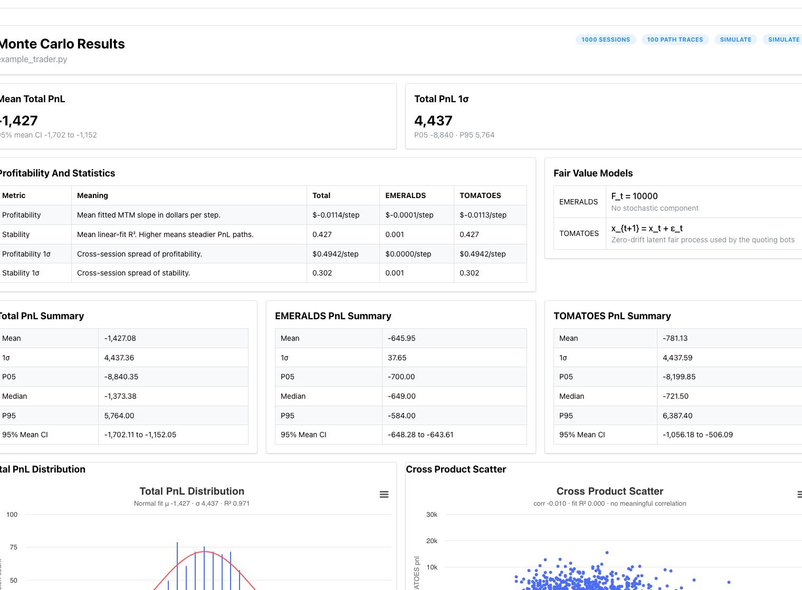
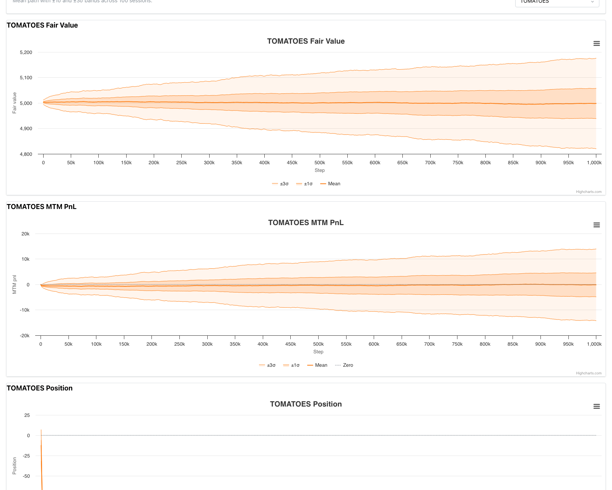

# IMC Prosperity 4

My code from IMC Prosperity 4, a fifteen-day algorithmic trading competition. Each round you get a couple of days of order book data for a set of fictional products, write a Python bot that quotes them, and submit once. The submission trades live against everyone else's bots, and that result is your score for the round.

I'm Roy Vaid. I went in because I wanted to actually trade something, and the part that kept nagging me was how little data you submit against. A strategy that looked clean on the two sample days would still lose when it ran live. One backtest number told me almost nothing about whether it was good or just lucky on those particular days.

Most of what's here is market making: quote both sides around an estimate of fair value, and lean the quotes against your inventory so you aren't holding a big position when the price moves. That follows Avellaneda and Stoikov, [High-frequency trading in a limit order book](https://www.math.nyu.edu/~avellane/HighFrequencyTrading.pdf) (2008), which gives you a reservation price and a spread as a function of inventory and risk aversion.

To get past the single-number problem I used a Monte Carlo backtester (embedded under `imc-prosperity-4/`) that rebuilds a round from the order book statistics and replays the trader across thousands of simulated days. Instead of one PnL you get a distribution, which is what I actually wanted to look at.

## Figures

These runs use the stock starter trader as a baseline, so the numbers are a losing template rather than a finished strategy. What I care about here is the shape.

Summary view over 1000 simulated days: mean PnL, the 5th and 95th percentiles, and a per-product split.

The same trader's PnL across days. A mean near zero hides outcomes from roughly minus 9k to plus 6k, which is the spread I was trying to see in the first place.

Fair value and mark-to-market PnL drawn as fan charts: the mean path with one and three sigma bands across every session.
